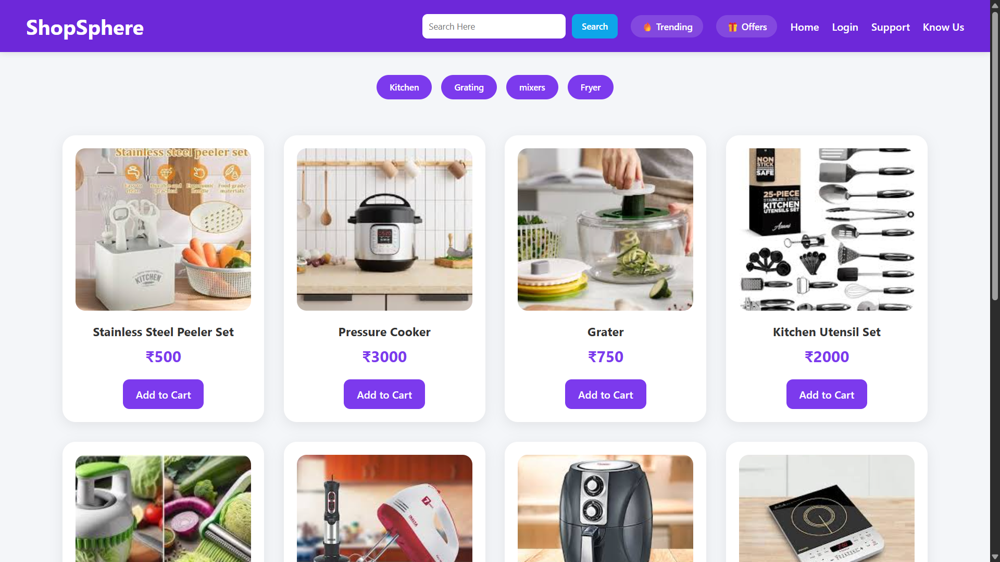
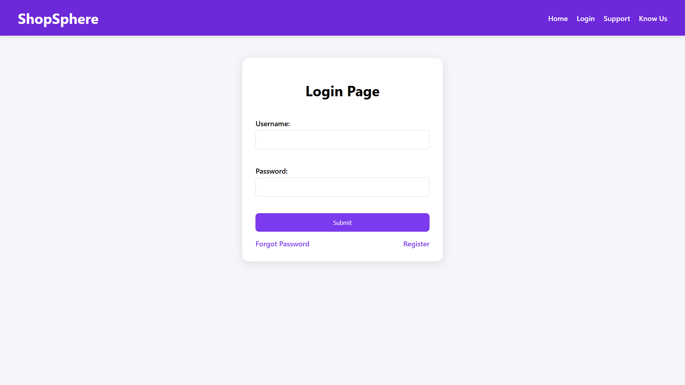
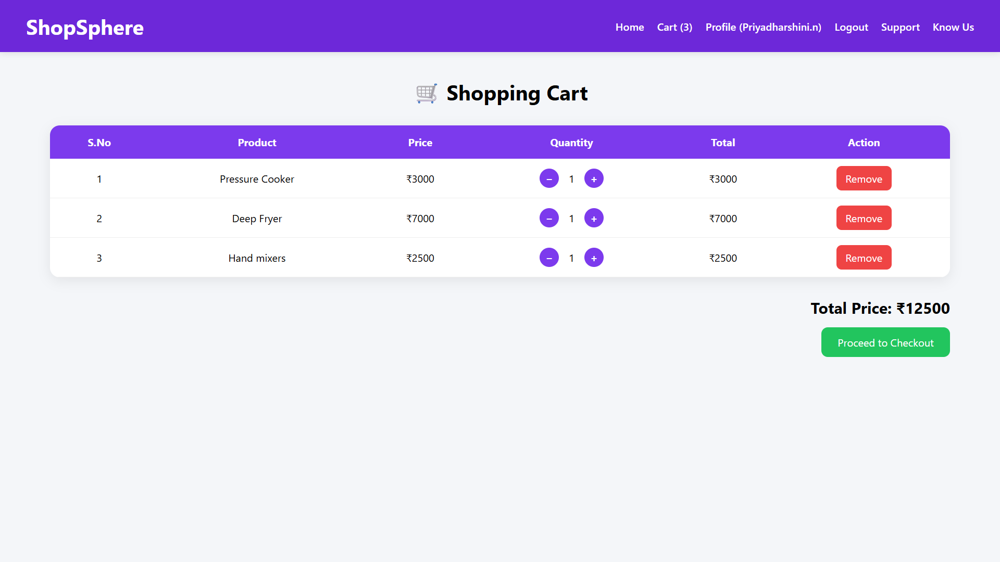
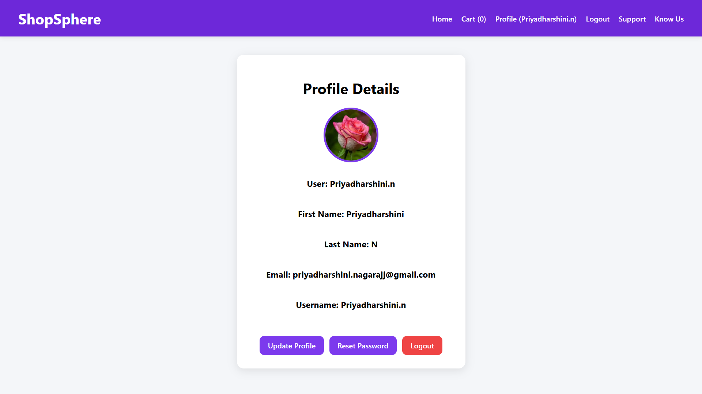

# 🛍️ ShopSphere

ShopSphere is a Django-based E-Commerce Web Application that allows users to browse products, search by category, manage carts, and maintain personal profiles through a clean and responsive interface.

## 🚀 Live Demo

🌐 Live Website: https://shopsphere-2qe1.onrender.com

## ✨ Features

### User Authentication

* User Registration
* User Login
* Logout
* Profile Management
* Update Profile
* Reset Password
* Forgot Password

### Product Management

* View Products
* Search Products
* Category Filtering
* Trending Products
* Offer Products

### Cart System

* Add to Cart
* Increase Quantity
* Decrease Quantity
* Remove Products
* Dynamic Cart Total
* User-specific Cart Management

### UI Features

* Responsive Design
* Modern Navigation Bar
* Product Cards
* Profile Dashboard
* Shopping Cart Interface

## 🛠️ Tech Stack

### Backend

* Python
* Django

### Frontend

* HTML5
* CSS3

### Database

* SQLite3

### Deployment

* Render

## 📂 Project Structure

```text
ShopSphere/
│
├── authen/
├── base/
├── myproject/
│   ├── settings.py
│   ├── urls.py
│   ├── wsgi.py
│
├── static/
├── templates/
├── manage.py
├── requirements.txt
└── build.sh
```

## ⚙️ Installation

### Clone Repository

```bash
git clone https://github.com/priyadharshini-nagaraj/ShopSphere.git
```

### Move into Project

```bash
cd ShopSphere
```

### Install Dependencies

```bash
pip install -r requirements.txt
```

### Run Migrations

```bash
python manage.py migrate
```

### Start Server

```bash
python manage.py runserver
```

### Open Browser

```text
http://127.0.0.1:8000/
```

## 📸 Screenshots

Add screenshots here.

### Home Page



### Login Page



### Cart Page



### Profile Page



## 📚 Concepts Practiced

* Django Models
* Django Views
* URL Routing
* Template Inheritance
* User Authentication
* Session Management
* CRUD Operations
* Static & Media Files
* Deployment on Render

## 🔮 Future Enhancements

* Django REST Framework APIs
* Wishlist Feature
* Product Details Page
* Order Management
* Payment Gateway Integration
* Product Reviews & Ratings
* JWT Authentication

## 👩‍💻 Author

**Priya Dharshini**

GitHub:
https://github.com/priyadharshini-nagaraj

---

⭐ If you like this project, consider giving it a star.
